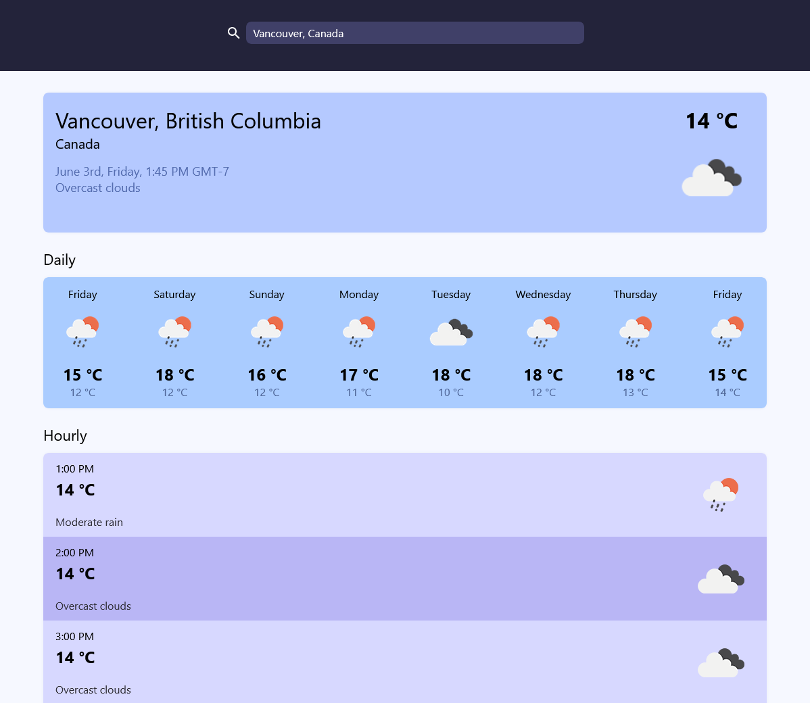
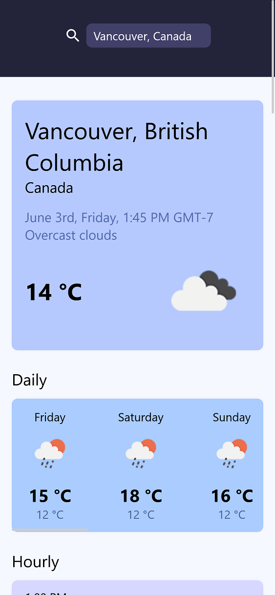

# Weather App

A website to get current, daily, and hourly weather information written in HTML, TS, and CSS.

Uses [OpenWeather's API](https://openweathermap.org/).

### Large screen

### Small screen

Created as part of [The Odin Project course](https://www.theodinproject.com/).
